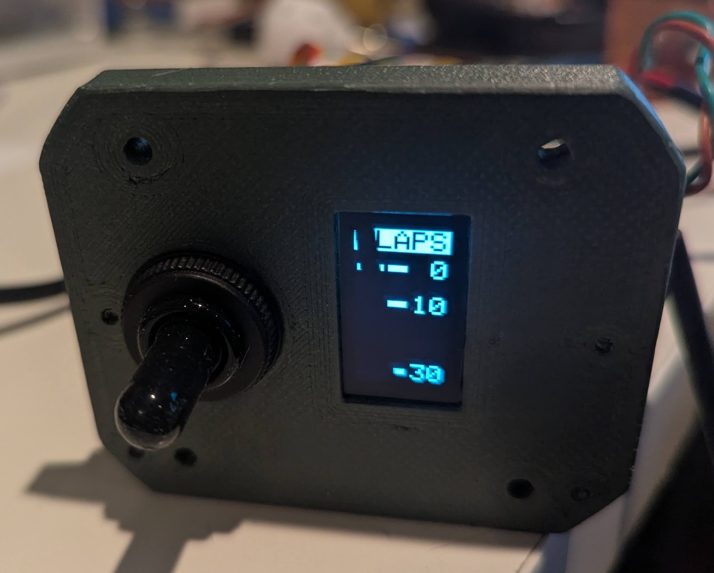
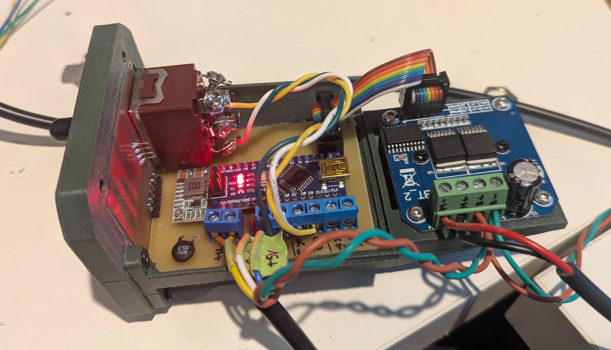

# Sonex Flap Control
This is an experimental ameteur built (EAB) electronic project that was designed for flap movement and position tracking in my Sonex B model aircraft kit. It uses an Arduino Nano in conjunction with an BTS7960/IBT_2 H-type motor driver to move the Sonex-supplied Electric Flap Actuator (Sonex part SNB-C05-11) and displays current flap position on a small OLED screen. Feel free to use it for your own purposes AT YOUR OWN RISK. It is released under MIT open source agreement license (see the license agreement listed in the root of the project). 

  

Multiple "notches" can be configured in software. By default, I have added 3 notches - 0 degrees, 10 degrees, and 30 degrees. Pressing the switch upward on the face triggers the arduino to retract the flaps to the previous notch. Pressing down the switch triggers the flaps to extend to the next notch. If the user presses the opposite direction, the flaps stop. However, if the pilot flips the switch in the opposite direction and holds it for more than half a second, the flaps will stop for the half second and then reverse to the next notch. The OLED screen updates constantly to notify the pilot of the current flap position. So if a builder decided to wire the switch directly to the flap actuator, the OLED screen will still keep track of the current position of the flaps, but the pilot would need to hold the switch until the flaps extend/retract to the desired position.

The code has more comment blocks than actual code describing what is happening. Pretty much every line or function has a very detailed description of what it does and what to change (if anything).

For example, after building the device it will need to be calibrated to work with your individual flap actuator (e.g. position readings are likely to be close between your flap actuator and mine, but are unlikely to be __*exactly*__ the same as mine). There is a line of code that you will want to uncomment to view the position reading on the Serial Monitor when the flaps are fully retracted and fully extended (see example below). Those values need to be entered into the code so the device can be sure to reach its __*full range*__ with your actuator. All of that is described in comment blocks in the code. Here's a sample of my comment blocks within the Arduino code file:

```
...

/**************************************************************************
These two values represent the values recevied on the A2 pin of the Arduino,
which is connected to the yellow wire of the position sensor of the flap
actuator. To calibrate your actuator, set the CALIBRATION_OUTPUT to true
and find the sensor reading that appears when  you retract/extend the flap 
actuator to its limits in both directions. Use whatever value appears in
the Serial Monitor to set the FULL_RETRACT_VALUE and FULL_EXTEND_VALUE 
settings here. Then turn off the CALIBRATION_OUTPUT by setting it to false.
No need to continue to output values to the Serial port when it's not
necessary. 
**************************************************************************/
#define FULL_RETRACT_VALUE  5
#define FULL_EXTEND_VALUE   881


/**************************************************************************
 Decide whether or not to output serial data and/or calibration data over
 the serial port (e.g. through the Arduino IDE's Serial Monitor). The 
 SERIAL_OUTPUT switch will output lots of (possibly) useful data. 
 
 If CALIBRATION_OUTPUT is set to true, it will output readings so you can 
 adjust the two values above to match the flap acutator's readings when
 it's extended/retracted fully. 
 
 It's recommended that you set the FULL_RETRACT_VALUE to 0 and the 
 FULL_EXTEND_VALUE value to 1023 to start. Then set the CALIBRATION_OUTPUT 
 value to true and retract the actuator all the way.

 The output in the Serial Monitor will tell you what to put into the 
 FULL_RETRACT_VALUE. Then extend it all the way to figure out what the 
 FULL_EXTEND_VALUE should be set to. 
**************************************************************************/
#define SERIAL_OUTPUT       false
#define CALIBRATION_OUTPUT  false

...

```

The entire code base looks similar to this, with explainations for everything that's going on. If you're not a developer, reading through the comments can help you cut your teeth on Arduino C++ coding. 

# Parts/Supplies List
Here's a list of the parts I used while prototyping. You can probably find other vendors, but your mileage will likely vary. 
### Free-standing parts
  * __Sonex Electric Flap Actuator__
The Electric Flap Actuator requires a feedback circuit. Not all Sonex Electric Flap Actuators had the feedback circuit. To verify that yours has one, you will need to look at the two sets of wires coming out of the actuator. One of them will have a red and black wire - this is for 12-24V power. The other set of wires will have three leads - blue, white, and yellow. 
  * __Arduino Nano__ (https://www.amazon.com/dp/B07G99NNXL)
  * __BTS7960/IBT_2 H-Bridge DC Motor Driver__ (https://www.amazon.com/dp/B099N8XS5P)
  * __.96 inch OLED I2C Display Module - 128x64 pixels__ (https://www.amazon.com/dp/B09T6SJBV5)
  * __Marine-grade heavy duty 12V ON-OFF-ON momentary toggle switch__ (https://www.amazon.com/dp/B0F9P9L9G6)

### PCB-related Parts
Custom Printed Cirtuit Boards are required for this project. For the prototype, I used my ancient Canon laser printer to print a mirrored image on special paper, an iron to transfer the toner to a blank single-sided 
  * __FR-4 Copper Clad PCB Laminate, Single Side, 4x2.7 inch__ (https://www.amazon.com/dp/B01MCVLDDZ)
  * __Voltage Reducer/Buck Converter (set to 9V output)__ (https://www.amazon.com/dp/B08JZ5FVLC)
  * __PCB Screw Terminal Blocks__ (https://www.amazon.com/dp/B014GMRBH2) 
  * __Straight AND Right Angle 2.54mm Male Header Pins__ (https://www.amazon.com/dp/B0CN14TP2T)
  * __2x4 8P 2.54mm Straight Male Shrouded PCB Box Header IDC Socket__ (https://www.amazon.com/dp/B08DYFQKB1)

The Socket makes connecting the custom PCB to the motor driver board very simple and clean. You have two choices for the cable - you can buy the components and make your own custom cable (which is what I did) or you can purchase one already complete. I opted to make my own because the pre-made ones are a little too long and I didn't like that. 
  * __(pre-made) 2x4 Ribbon Cable__ (https://www.amazon.com/dp/B07DFBPZLJ)
  * __(custom) 2x4 FC-8P 2.54mm Dual Rows IDC Sockets Female Connector for Flat Ribbon Cable__ (https://www.amazon.com/dp/B0BVHMTY5S)
  * __(custom) Flat Ribbon Cable for 2.54mm 0.1" Spacing Connectors__ (https://www.amazon.com/dp/B0762ZCRYN)

### Other Recommended Parts
  * __Ferrule Crimping Tool and Connectors - crimp ends of wires to reduce fatigue__ (https://www.amazon.com/dp/B0DRJ9CDNG)
  * __22 AWG Stranded Tinned Copper Wire with Silicone Insulation__ (https://www.amazon.com/dp/B0881HCN37)


# Wiring
There are two sets of wires coming out of the Electronic Flap Actuator. One set is for powering the motion of the Actuator and the other set is for reporting its position.

### Power Wires

While the actuator has a red and a black wire coming out of it for motion, they won't always be positive/negative. If you give the red wire +12V and the black wire -12V, it will extend. If you reverse the polarity (+12V to black and -12V to red) the actuator will retract:
  * 🔴 RED:   Power (+ to extend, - to retract)
  * ⚫ BLACK: Power (- to extend, + to retract)

That said, there are two options for how to wire up the power to the actuator:

* You can wire the actuator to directly use 12/24V with a 6-pole, ON-OFF-ON momentary switch wired up like this (I got this diagram from an email sent to me by Sonex Support). This requires the pilot to press and hold the switch until the flaps reach the desired position:

  

* -OR- You can use the motor driver to change the polarity of the actuator for you. In this case, the motor controller is controlled by the Arduino and programmed to move the actuator in notches - so the pilot just flips and releases the switch in the direction the flaps should go for literally a few milliseconds - no need to hold it - and then goes back to flying the airplane while the flaps move to the desired position with no additional input required from the pilot.

Both of these options will work with the indicator, requiring no change to the code. The Arduino will listen for switch input, but if no pilot input is received, it just merrily skips to the position reading and diplays it on the little screen. 

#### Motor Driver Use Discussion
The motor driver has several inputs and two outputs. The two outputs are the red and black wires on the actuator. The motor driver will determine how much voltage (and which polarity - remember we need to reverse the polarity to the actuator for retraction) to push to the actuator based on the other pins. Here's a list of the other pins and what they do:

* __M-__ - Output to the Actuator (this will output positive or negative power, depending on which way the actuator should move)
* __M+__ - Other output to the Actuator (this will output negative or positive power, depending on which way the actuator should move)
* __B-__ - This is the max negative power source/ground of the airplane 
* __B+__ - This is the max positive power (e.g. +12V from the battery) that can be pushed to the actuator. The Motor Driver can handle up to 36V, but I suggest just using the common 12V or 24V.
* __VCC__ - This is 5V provided by the Arduino. It's only used to power the LOGIC of the motor driver (not the motor itself)
* __GND__ - This is a common ground between the Arduino and the Motor Driver
* __R_IS__ and __L_IS__ - These two pins are not used in this project - I think they're for re-programming the motor driver or something like that. Just ignore them.
* __R_EN__ and __L_EN__ - These two pins are given 5V, which "enables" the two BTS7960 chips (one is on the right and one is on the left). If these pins are not "enabled" with 5V, the motor driver won't send any power to the Actuator
* __RPWM__ and __LPWM__ - These two pins are controlled by the Arduino - one for each BTS7960 chip on the Motor Driver board. Depending on the PWM signal from the arduino on either of these two pins, the motor driver will send a variable voltage to the actuator. To extend, we give a high PWM to the RPWM pin and NO signal to the LPWM pin. To retract, we give a high PWM signal to the LPWM pin and NO signal to the RPWM pin. see below for a description of PWM.

#### PWM Discussion
Pulse Width Modulation (PWM) is determined by turning a signal pin on and off at varying rates. Arduinos are designed to do this on their digital pins. We can set a PWM value between 0 and 255 on any Arduino digital pin. A PWM cycle is the amount of time in which a pin goes from on to off. Each PWM cycle on a typical Arduino (such as the Nano used in the project), that cycle is about every 2 milliseconds. 

A PWM value of 0 denotes that the pin is always outputting 0V. A PWM of 255 denotes that the pin
is always outputting 5V. 

A PWM output of 127 means that a pin is on (5V) for about 1ms and off (0V) for about 1ms. 

A PWM of 63 (half of 127) means that the pin will be turned on (5V) for 500 micro seconds (half of a millisecond) and off (0V) for 1500 microseconds (1.5 milliseconds). Or in other words, for about 1/4 of the cycle the pin will be outputting 5V and the other 3/4 of the cycle it will be outputting 0V.

To tell the Motor Driver to move the actuator in one direction or the other, you need to send two PWM signals - one to each of the BTS7960 chips. 

To extend the actuator, we would send a PWM of 0 to the RPWM pin and a PWM of 255 to the LPWM pin on the motor driver. This will cause the output terminal to push +12V to the red wire and -12V to the black wire on the actuator. 

To retract the actuator, we do the opposite. E.g. send a PWM of 0 to the LPWM pin and a PWM of 255 to the RPWM pin on the driver. This will revers the polarity to the actuator +12V on the BLACK wire and -12V on the RED wire. 

To slow down the motion of actuator, you would set your PWM signal at a low number - say 10. 

To speed up the movement of the actuator, you would increase the PWM to something higher - 1 to 255. 

There's a good write-up on Arduino's website about PWM - it's worth reading:
https://docs.arduino.cc/learn/microcontrollers/analog-output/ 

Note: For this project, there's no danger in just telling the motor controller to move in one direction at full speed until it reaches it's desired flap position. The actuator moves slowly enough to not worry about overshooting your flap setting by very much - I've added an additional threshold variable to account for the actuator "coasting" momentarily after telling it to stop. If set properly, this threshold will stop the actuator exactly where you want it to stop.

Now, on to the other set of wires coming out of the Electronic Flap Actuator ...

### Position Sensor Wires

The real benefit to this project is the flap position indicator. You can use the built-in position sensor to display the position of the flaps on your panel.

  * 🔵 BLUE: +5V
  * ⚪ WHITE: -5V/Ground
  * 🟡 YELLOW: 0 to +5V Signal wire (read by analog pin A2 on Arduino)

Every time the Arduino loops through the aptly named loop() function, it checks to see if there's any input from the pilot (if so, it tries to do what the pilot told it to do) and it also takes a reading from the sensor wires and updates the OLED screen with the new reading. This happens hundreds of times per second and gives near instant updates on the little screen. 

#### How the position sensor works
The position sensor is fed +5V on the blue wire and -5V on the white wire. There's a potentiometer in between with an output (yellow wire) that will output anywhere from 0V (if fully retracted) to +5V (if fully extended). If it's roughly halfway between the two, the yellow wire will output about +2.5V. 

One of the Arduino's analog pins (in this case A2) is set up to listen to the amount of voltage coming through that yellow wire. It then translates that voltage to a number between 0 and 1023. In the code, we then use a "map()" function to interpolate the value from a min/max range that the pin can read (0-1023) to a range that makes sense from a "degrees of flaps" perspective (this is defined in the code 0-30, but can be eaily changed to something else). The map() function works like this:

```
map([value recevied from yellow wire - 0-1023], [min input value - e.g. fully retracted reading], [max input value - e.g. fully extended reading], [min flap angle as defined], [max flap angle as defined]); 
```

So, given that:

* our sensor is currently sending 2.5V to the Arduino, so the Arduino reads __511__ (half way between 0 and 1023)
* our min/max values that the sensor outputs (say 0 to +5V) is converted to a number between __0__ and __1023__
* our min/max angle settings are __0__ and __30__  

that means our map() function would look like this:

__flapAngle = map(511, 0, 1023, 0, 30);__

In this case, the flapAngle variable would be set to 15 degrees of flap (e.g. half way between 0 and 30, because the actuator's sensor is reporting that it's halfway between fully extended and fully retracted). 

Once we have that value, we use a handy little OLED library written by the folks at Adafruit to draw a little rectangle on the left half of the screen (showing graphically where the flaps are currently positioned) next to a previously drawn set of lines and numbers showing where certain values will appear on the screen (on the right). 

Incedentally, we use another map() function to convert the angle value we figured out a minute ago to determine where to place the little rectangle based on the number of pixels high the screen is, minus the text at the top that says FLAPS. Giving similar values, our map() function to find the vertical position of our rectangle would look like this (where the range of available pixels is 8 to 128):

rectangleTopLeftCorner = (15, 0, 30, 8, 128); 

So the rectangleTopLeftCorner variable would be set to 60 - which means the rectangle's top left corner would be drawn on the screen at 60 pixels from the top. map() is a very handy little function!

Anyway, that's a pretty good intro. For more details, go read the comment blocks in the code - I explain a lot more there. 


